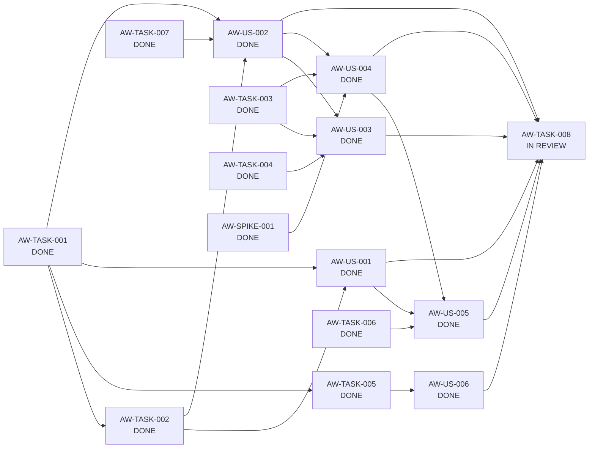

# Block 01 — Enablers, Spikes & Dependencies

**Status:** `IMPLEMENTING / TERMINAL REGRESSION GATE IN REVIEW`

This file separates actor-visible Stories from technical enabling work according to `STD-WMS-001` / `STD-WMS-TYPES-001`. No `Technical Story` type is introduced.

## Enabling Tasks

### PTL-TASK-AW-001 — AnnualTaxWorkspace domain/application contract

**Type:** Task  
**Role:** ENABLER  
**Size:** M  
**Priority:** P0  
**Status:** DONE

Define a first-class annual workspace contract keyed by `commercialYear` and suitable for all TAX capabilities. Evidence: [`task-aw-001-evidence.md`](task-aw-001-evidence.md). Canonical `make validate`: 115/115 plus desktop/architecture checks.

---

### PTL-TASK-AW-002 — Persistence and migration from implicit settings.year

**Type:** Task  
**Role:** ENABLER  
**Size:** M  
**Priority:** P0  
**Status:** DONE

Annual workspace metadata persistence and deterministic compatibility migration are implemented without copying tax facts. Evidence: [`task-aw-002-evidence.md`](task-aw-002-evidence.md). Canonical `make validate`: 118/118 plus desktop/architecture checks.

---

### PTL-TASK-AW-003 — TaxApplicabilityProfile schema and repository

**Type:** Task  
**Role:** ENABLER  
**Size:** M  
**Priority:** P0  
**Status:** DONE

Versioned `TaxApplicabilityProfile` v1 with the closed five-dimension allowlist, strict `YES | NO | UNKNOWN` semantics, SQLite persistence by `annualWorkspaceId`, trusted annual context and no dependency on canonical fact repositories.

Evidence: [`task-aw-003-evidence.md`](task-aw-003-evidence.md). Canonical `make validate`: 155/155 plus desktop/architecture checks.

---

### PTL-TASK-AW-004 — Allowlisted prior-year initialization service

**Type:** Task  
**Role:** ENABLER  
**Size:** M  
**Priority:** P1  
**Status:** DONE

Explicit reusable-category allowlist with `APPLICABILITY_PROFILE` as a revisable proposal; explicit forbidden-copy catalog; separate persisted provenance; idempotent repeat; rollback and prior active-year restoration after partial failure; no transactional repository discovery/inference.

Evidence: [`task-aw-004-evidence.md`](task-aw-004-evidence.md). Canonical `make validate`: PASS after reconciling the stale AW-002 frontend assertion.

---

### PTL-TASK-AW-005 — Trusted workspace context propagation

**Type:** Task  
**Role:** ENABLER  
**Size:** L  
**Priority:** P0  
**Status:** DONE

Trusted annual identity, per-request resolution, cross-year validation, stale mutation protection, HTTP conflict semantics, frontend generation protection and annual audit context are implemented. Evidence: [`task-aw-005-evidence.md`](task-aw-005-evidence.md). Canonical `make validate`: 127/127.

---

### PTL-TASK-AW-006 — Annual workspace overview projection

**Type:** Task  
**Role:** ENABLER  
**Size:** M  
**Priority:** P0  
**Status:** DONE

Structural read model for period, applicability completeness, domain-data presence/counts, evidence availability and exact-year rule status. It deliberately excludes tax outcome, readiness, SII reconciliation and optimization.

Evidence: [`task-aw-006-evidence.md`](task-aw-006-evidence.md). Canonical `make validate`: 169/169 plus desktop/architecture checks.

---

### PTL-TASK-AW-007 — Supported-year and rule-availability policy

**Type:** Task  
**Role:** ENABLER  
**Size:** S  
**Priority:** P0  
**Status:** DONE

Provider-neutral exact-year support policy with `SUPPORTED`, `SUPPORTED_WITH_WARNINGS`, `UNSUPPORTED`. Evidence: [`task-aw-007-evidence.md`](task-aw-007-evidence.md). Canonical `make validate`: 136/136.

---

### PTL-TASK-AW-008 — Block-level automated regression suite

**Type:** Task  
**Role:** QUALITY_ENABLER  
**Size:** M  
**Priority:** P0  
**Status:** IN_REVIEW

Implemented on `chore/block-01-terminal-regression-gate` as a dedicated cross-feature suite covering:

- explicit workspace authority, duplicate safety and unsupported-year blocking;
- stale mutation rejection after active workspace transition;
- profile declaration vs canonical fact conflict semantics;
- structural overview hard boundary;
- prior-year allowlist, provenance and idempotency.

The specialized suites remain authoritative for SQLite migration/materialization, frontend stale-response suppression, rollback failure paths, adapter persistence, desktop syntax and architecture boundaries.

Evidence: [`task-aw-008-evidence.md`](task-aw-008-evidence.md). Closure gate: fresh canonical `make validate` from the AW-008 branch.

## Spike

### PTL-SPIKE-AW-001 — Validate minimum annual applicability dimensions

**Status:** DONE  
**Closed:** 2026-09-12

Accepted dimensions:

- `DEPENDENT_INCOME`;
- `DOMESTIC_FEE_INCOME`;
- `FOREIGN_SERVICE_INCOME`;
- `APV_CONTRIBUTIONS`;
- `MORTGAGE_INTEREST`.

Rejected from this profile:

- actual-expense evaluation/election;
- AFP/health applicability flag.

## Dependency graph



## Closed baseline

All functional Stories `PTL-US-AW-001..006`, Spike AW-001 and enabling Tasks `PTL-TASK-AW-001..007` are DONE and canonically validated.

## Current executable node

`PTL-TASK-AW-008 — Block-level automated regression suite` — **IN_REVIEW**.

## Critical safety chain

```text
TASK-AW-001 [DONE]
 -> TASK-AW-005 [DONE]
 -> US-AW-006 [DONE]
 -> TASK-AW-008 [IN REVIEW / TERMINAL GATE]
```

## Block readiness verdict

Block 01 has no remaining feature dependency. Closure now depends only on a clean canonical validation of the terminal cross-feature regression suite and final DoD evidence.
