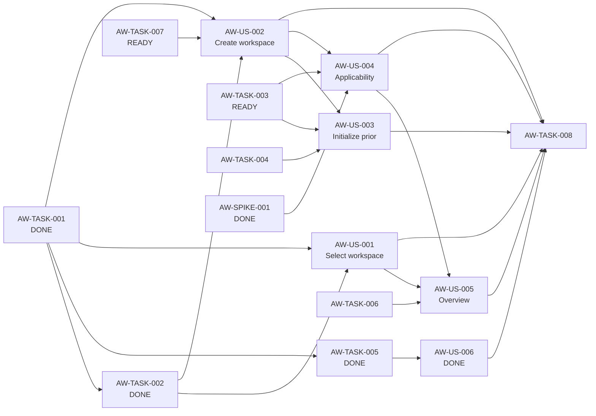

# Block 01 — Enablers, Spikes & Dependencies

**Status:** `IMPLEMENTING / SAFETY CHAIN CLOSED THROUGH AW-006`

This file separates actor-visible Stories from technical enabling work according to `STD-WMS-001` / `STD-WMS-TYPES-001`. No `Technical Story` type is introduced.

## Enabling Tasks

### PTL-TASK-AW-001 — AnnualTaxWorkspace domain/application contract

**Type:** Task  
**Role:** ENABLER  
**Size:** M  
**Priority:** P0  
**Status:** DONE

Define a first-class annual workspace contract keyed by `commercialYear` and suitable for all TAX capabilities.

Validation/closure evidence: [`task-aw-001-evidence.md`](task-aw-001-evidence.md). Canonical `make validate` passed with 115/115 tests plus desktop and architecture checks.

**Enables:** AW-001, AW-002, AW-006.

---

### PTL-TASK-AW-002 — Persistence and migration from implicit settings.year

**Type:** Task  
**Role:** ENABLER  
**Size:** M  
**Priority:** P0  
**Status:** DONE

Annual workspace metadata persistence and deterministic compatibility migration are implemented without copying tax facts. Workspace materialization uses `settings.year` plus actual user/domain years and excludes rule-catalog seed years as independent workspace evidence.

Evidence: [`sqlite-migration-assessment.md`](sqlite-migration-assessment.md), [`task-aw-002-evidence.md`](task-aw-002-evidence.md). Canonical `make validate` passed with 118/118 tests plus desktop and architecture checks.

**Enables:** AW-001, AW-002, AW-006.

---

### PTL-TASK-AW-003 — TaxApplicabilityProfile schema and repository

**Type:** Task  
**Role:** ENABLER  
**Size:** M  
**Priority:** P0  
**Status:** READY

Persist annual applicability independently from actual facts using the five dimensions closed by [`spike-aw-001-applicability-profile.md`](spike-aw-001-applicability-profile.md).

`Applicability profile != actual tax facts` remains mandatory.

**Enables:** AW-003, AW-004, AW-005.

---

### PTL-TASK-AW-004 — Allowlisted prior-year initialization service

**Type:** Task  
**Role:** ENABLER  
**Size:** M  
**Priority:** P1  
**Status:** BLOCKED_BY_AW_003

Create a category-aware allowlisted service that reuses configuration/proposals only. Copying all rows for a prior `tax_year` is forbidden.

**Enables:** AW-003.

---

### PTL-TASK-AW-005 — Trusted workspace context propagation

**Type:** Task  
**Role:** ENABLER  
**Size:** L  
**Priority:** P0  
**Status:** DONE

Delivered and merged:

- trusted `AnnualWorkspaceContext` with `annualWorkspaceId + commercialYear`;
- per-request active-context resolution;
- application-boundary year validation for mutable annual domains;
- persisted-entity year checks for update/delete;
- active-context revalidation immediately before persistence;
- HTTP `409 workspace_year_mismatch` semantics;
- frontend generation-based stale-response suppression;
- execution-log annual context enrichment;
- compatibility rematerialization after legacy year switching.

Evidence: [`task-aw-005-evidence.md`](task-aw-005-evidence.md). Canonical `make validate` passed with 127/127 tests plus desktop and architecture checks.

**Enables:** AW-006 and safe downstream TAX blocks.

---

### PTL-TASK-AW-006 — Annual workspace overview projection

**Type:** Task  
**Role:** ENABLER  
**Size:** M  
**Priority:** P0  
**Status:** BLOCKED_BY_AW_003_AW_004

Build a structural read model for AW-005 without turning it into Annual Tax Health. Candidate fields remain commercial year/AT, lifecycle, profile completeness, structural counts/presence, rule provenance and last update timestamp.

**Enables:** AW-005.

---

### PTL-TASK-AW-007 — Supported-year and rule-availability policy

**Type:** Task  
**Role:** ENABLER  
**Size:** S  
**Priority:** P0  
**Status:** READY

Define provider-neutral behavior for creating/opening a commercial year for which PTL lacks a compatible rule set.

Required states:

- `SUPPORTED`;
- `SUPPORTED_WITH_WARNINGS`;
- `UNSUPPORTED`.

The policy must consume rule/configuration capabilities instead of hard-coding UI-only year limits.

**Enables:** AW-002.

---

### PTL-TASK-AW-008 — Block-level automated regression suite

**Type:** Task  
**Role:** QUALITY_ENABLER  
**Size:** M  
**Priority:** P0  
**Status:** NOT_READY_FOR_CLOSURE

Final regression coverage must include:

- migration from implicit-year persistence — available;
- select/create year and duplicate-year behavior — pending AW-001/AW-002 Stories;
- strict year isolation and stale async protection — available via AW-005/AW-006;
- prior-year initialization allowlist — pending AW-004/US-AW-003;
- tri-state applicability profile — pending AW-003/US-AW-004;
- workspace overview projection — pending TASK-AW-006/US-AW-005.

AW-008 is now reached by the safety chain, but starting a long-lived closure PR before these behaviors exist would create a partial regression suite and violate the no-accumulated-PR operating model.

**Requires:** implementation Tasks/Stories above.  
**Enables:** block DoD.

## Spike

### PTL-SPIKE-AW-001 — Validate minimum annual applicability dimensions

**Status:** DONE  
**Closed:** 2026-09-12

Accepted dimensions:

- `DEPENDENT_INCOME`;
- `DOMESTIC_FEE_INCOME`;
- `FOREIGN_SERVICE_INCOME`;
- `APV_CONTRIBUTIONS`;
- `MORTGAGE_INTEREST`.

Rejected from this profile:

- actual-expense evaluation/election;
- AFP/health applicability flag.

## Dependency graph



## Fast lane status

### Foundation / persistence

- SPIKE-AW-001 — DONE
- TASK-AW-001 — DONE
- TASK-AW-002 — DONE
- TASK-AW-005 — DONE
- US-AW-006 — DONE (`make validate`: 131/131, desktop/architecture clean)

### Next executable P0 path

1. `PTL-TASK-AW-007 — Supported-year and rule-availability policy` — READY
2. `PTL-US-AW-001 — Select workspace`
3. `PTL-US-AW-002 — Create workspace`
4. `PTL-TASK-AW-003 — TaxApplicabilityProfile`
5. `PTL-US-AW-004 — Applicability Profile`
6. `PTL-TASK-AW-006 + PTL-US-AW-005 — Workspace overview`
7. P1 initialization branch (`AW-004 + US-AW-003`)
8. `PTL-TASK-AW-008` final regression closure

## Critical safety chain

```text
TASK-AW-001 [DONE]
 -> TASK-AW-005 [DONE]
 -> US-AW-006 [DONE]
 -> TASK-AW-008 [REACHED, NOT YET CLOSABLE]
```

The safety invariant is now implemented and validated. AW-008 remains the final block-level gate, not the next feature implementation while required block behaviors are still absent.

## Block readiness verdict

The highest-value next executable dependency is `PTL-TASK-AW-007`, because it is P0/READY and unblocks explicit annual workspace creation (`US-AW-002`). This advances the first usable vertical slice without opening a partial long-lived AW-008 PR.
