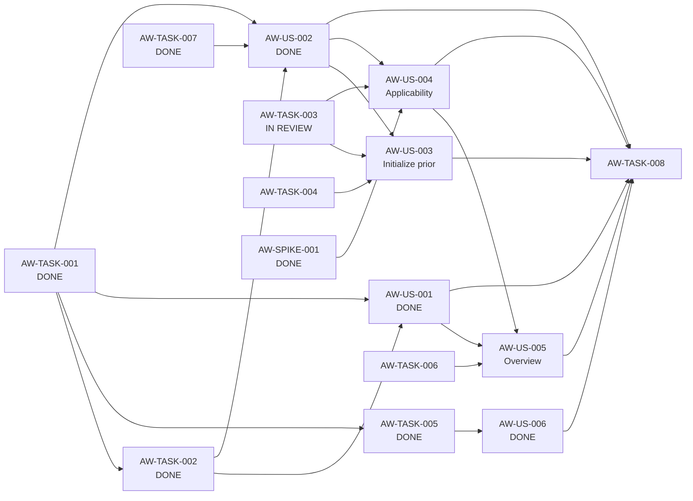

# Block 01 — Enablers, Spikes & Dependencies

**Status:** `IMPLEMENTING / APPLICABILITY FOUNDATION IN REVIEW`

This file separates actor-visible Stories from technical enabling work according to `STD-WMS-001` / `STD-WMS-TYPES-001`. No `Technical Story` type is introduced.

## Enabling Tasks

### PTL-TASK-AW-001 — AnnualTaxWorkspace domain/application contract

**Type:** Task  
**Role:** ENABLER  
**Size:** M  
**Priority:** P0  
**Status:** DONE

Define a first-class annual workspace contract keyed by `commercialYear` and suitable for all TAX capabilities. Evidence: [`task-aw-001-evidence.md`](task-aw-001-evidence.md). Canonical `make validate`: 115/115 plus desktop/architecture checks.

---

### PTL-TASK-AW-002 — Persistence and migration from implicit settings.year

**Type:** Task  
**Role:** ENABLER  
**Size:** M  
**Priority:** P0  
**Status:** DONE

Annual workspace metadata persistence and deterministic compatibility migration are implemented without copying tax facts. Evidence: [`task-aw-002-evidence.md`](task-aw-002-evidence.md). Canonical `make validate`: 118/118 plus desktop/architecture checks.

---

### PTL-TASK-AW-003 — TaxApplicabilityProfile schema and repository

**Type:** Task  
**Role:** ENABLER  
**Size:** M  
**Priority:** P0  
**Status:** IN_REVIEW

Implemented on `feat/block-01-tax-applicability-profile`:

- versioned `TaxApplicabilityProfile` domain contract (`profileVersion = 1`);
- exact five-dimension allowlist from the closed Spike;
- strict `YES | NO | UNKNOWN` semantics;
- missing values normalize to `UNKNOWN`;
- repository port keyed by `annualWorkspaceId`;
- SQLite persistence of the versioned profile document;
- trusted AnnualWorkspaceContext and stale-mutation guard on save;
- no dependency on canonical fact repositories.

`Applicability profile != actual tax facts` remains mandatory.

Evidence: [`task-aw-003-evidence.md`](task-aw-003-evidence.md). Closure gate: canonical `make validate`.

**Enables:** AW-003, AW-004, AW-005.

---

### PTL-TASK-AW-004 — Allowlisted prior-year initialization service

**Type:** Task  
**Role:** ENABLER  
**Size:** M  
**Priority:** P1  
**Status:** BLOCKED_BY_AW_003

Create a category-aware allowlisted service that reuses configuration/proposals only. Copying all rows for a prior `tax_year` is forbidden.

---

### PTL-TASK-AW-005 — Trusted workspace context propagation

**Type:** Task  
**Role:** ENABLER  
**Size:** L  
**Priority:** P0  
**Status:** DONE

Trusted annual identity, per-request resolution, cross-year validation, stale mutation protection, HTTP conflict semantics, frontend generation protection and annual audit context are implemented. Evidence: [`task-aw-005-evidence.md`](task-aw-005-evidence.md). Canonical `make validate`: 127/127.

---

### PTL-TASK-AW-006 — Annual workspace overview projection

**Type:** Task  
**Role:** ENABLER  
**Size:** M  
**Priority:** P0  
**Status:** BLOCKED_BY_AW_003_AW_004

Build a structural read model for AW-005 without turning it into Annual Tax Health.

---

### PTL-TASK-AW-007 — Supported-year and rule-availability policy

**Type:** Task  
**Role:** ENABLER  
**Size:** S  
**Priority:** P0  
**Status:** DONE

Provider-neutral exact-year support policy with `SUPPORTED`, `SUPPORTED_WITH_WARNINGS`, `UNSUPPORTED`. Evidence: [`task-aw-007-evidence.md`](task-aw-007-evidence.md). Canonical `make validate`: 136/136.

---

### PTL-TASK-AW-008 — Block-level automated regression suite

**Type:** Task  
**Role:** QUALITY_ENABLER  
**Size:** M  
**Priority:** P0  
**Status:** NOT_READY_FOR_CLOSURE

Final regression coverage must include:

- migration from implicit-year persistence — AVAILABLE;
- select/create year and duplicate-year behavior — AVAILABLE via AW-001/AW-002;
- strict year isolation and stale async protection — AVAILABLE via AW-005/AW-006;
- supported-year policy — AVAILABLE via AW-007;
- prior-year initialization allowlist — pending AW-004/US-AW-003;
- tri-state applicability profile — FOUNDATION IN REVIEW via AW-003; UI/conflict behavior pending US-AW-004;
- workspace overview projection — pending TASK-AW-006/US-AW-005.

AW-008 remains the terminal block-quality gate; it should not become a long-lived partial PR.

## Spike

### PTL-SPIKE-AW-001 — Validate minimum annual applicability dimensions

**Status:** DONE  
**Closed:** 2026-09-12

Accepted dimensions:

- `DEPENDENT_INCOME`;
- `DOMESTIC_FEE_INCOME`;
- `FOREIGN_SERVICE_INCOME`;
- `APV_CONTRIBUTIONS`;
- `MORTGAGE_INTEREST`.

Rejected from this profile:

- actual-expense evaluation/election;
- AFP/health applicability flag.

## Dependency graph



## Fast lane status

### Closed baseline

- SPIKE-AW-001 — DONE
- TASK-AW-001 — DONE
- TASK-AW-002 — DONE
- TASK-AW-005 — DONE
- US-AW-006 — DONE (`make validate`: 131/131)
- TASK-AW-007 — DONE (`make validate`: 136/136)
- US-AW-001 + US-AW-002 — DONE (`make validate`: 149/149, desktop/architecture clean)

### Current P0 node

1. `PTL-TASK-AW-003 — TaxApplicabilityProfile` — **IN_REVIEW**

### Next after clean closure

1. `PTL-US-AW-004 — Applicability Profile`
2. `PTL-TASK-AW-006 + PTL-US-AW-005 — Workspace overview`
3. P1 initialization branch (`AW-004 + US-AW-003`)
4. `PTL-TASK-AW-008` final regression closure

## Critical safety chain

```text
TASK-AW-001 [DONE]
 -> TASK-AW-005 [DONE]
 -> US-AW-006 [DONE]
 -> TASK-AW-008 [REACHED, NOT YET CLOSABLE]
```

## Block readiness verdict

AW-003 is implemented and awaiting canonical validation. Clean closure immediately unlocks `PTL-US-AW-004` as the next P0 Story and removes the data-schema blocker from the later prior-year initialization path.
