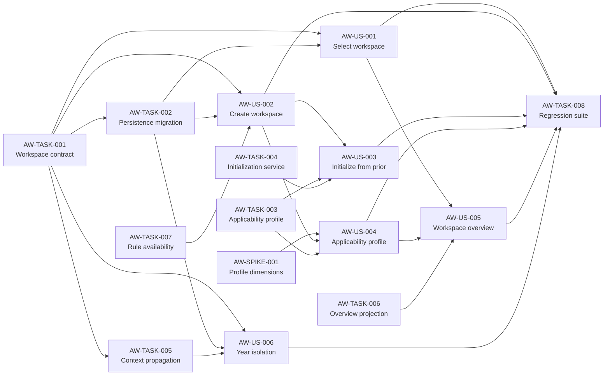

# Block 01 — Enablers, Spikes & Dependencies

**Status:** `DOGFOOD / REFINING`

This file separates actor-visible Stories from technical enabling work according to `STD-WMS-001` / `STD-WMS-TYPES-001`. No `Technical Story` type is introduced.

## Enabling Tasks

### PTL-TASK-AW-001 — AnnualTaxWorkspace domain/application contract

**Type:** Task  
**Role:** ENABLER  
**Size:** M  
**Priority:** P0

Define a first-class annual workspace contract keyed by `commercialYear` and suitable for all TAX capabilities.

Minimum semantics:

```text
AnnualTaxWorkspace
  id
  commercialYear
  derivedTaxYearLabel
  lifecycleState
  createdAt
  updatedAt
  ruleVersionRef
```

Constraints:

- `derivedTaxYearLabel` is derived, not independently editable;
- the contract does not absorb income/evidence/calculation entities;
- lifecycle must be compatible with future TAX-11 without implementing close/reopen here.

**Enables:** AW-001, AW-002, AW-006.

---

### PTL-TASK-AW-002 — Persistence and migration from implicit settings.year

**Type:** Task  
**Role:** ENABLER  
**Size:** L  
**Priority:** P0

Introduce workspace persistence/read APIs and migrate the existing implicit year model without losing current year-scoped data.

Required outcomes:

- discover existing distinct commercial years from persisted domain data/settings;
- materialize or map compatible workspace records deterministically;
- preserve current active year selection;
- no duplicate income/BHE/mortgage records;
- migration is rerunnable/idempotent or explicitly versioned;
- backup/restore compatibility is considered with existing local workspace behavior.

**Enables:** AW-001, AW-002, AW-006.

---

### PTL-TASK-AW-003 — TaxApplicabilityProfile schema and repository

**Type:** Task  
**Role:** ENABLER  
**Size:** M  
**Priority:** P0

Persist annual applicability independently from actual facts.

Conceptual contract:

```text
TaxApplicabilityProfile
  workspaceId
  dimensions[]
    key
    applicability: YES | NO | UNKNOWN
    source: USER_DECLARED | COPIED_PROPOSAL | DERIVED_CONFLICT
    updatedAt
```

Do not duplicate amounts or computed tax values.

**Enables:** AW-003, AW-004, AW-005.

---

### PTL-TASK-AW-004 — Allowlisted prior-year initialization service

**Type:** Task  
**Role:** ENABLER  
**Size:** M  
**Priority:** P1

Create a service that copies only explicitly allowlisted reusable configuration and produces provenance for every copied proposal/template.

Forbidden implementation pattern:

```text
copy all rows where tax_year = source into target year
```

The service must be category-aware and safe as the domain expands.

**Enables:** AW-003.

---

### PTL-TASK-AW-005 — Trusted workspace context propagation

**Type:** Task  
**Role:** ENABLER  
**Size:** L  
**Priority:** P0

Ensure UI, application services and year-scoped persistence operations consume a stable active-workspace identity and protect against stale async writes.

Required concerns:

- request/use-case context includes workspace/year identity;
- stale response suppression or request generation/versioning;
- mismatch validation at application boundary;
- year is logged in material operations;
- open forms cannot silently rebind to another year.

**Enables:** AW-006 and safe downstream TAX blocks.

---

### PTL-TASK-AW-006 — Annual workspace overview projection

**Type:** Task  
**Role:** ENABLER  
**Size:** M  
**Priority:** P0

Build a read model for AW-005 that aggregates structural presence/counts without becoming Annual Tax Health.

Candidate fields:

```text
commercialYear
operationRentaLabel
lifecycleState
profileAnsweredCount
profileUnknownCount
incomeSourceCount
feeReceiptCount
mortgageCount
evidenceCapabilityState
ruleVersionRef
parametersState
lastUpdatedAt
```

**Enables:** AW-005.

---

### PTL-TASK-AW-007 — Supported-year and rule-availability policy

**Type:** Task  
**Role:** ENABLER  
**Size:** S  
**Priority:** P0

Define provider-neutral behavior for creating/opening a commercial year for which PTL lacks a compatible rule set.

Required decision states:

- SUPPORTED;
- SUPPORTED_WITH_WARNINGS;
- UNSUPPORTED.

This Task must consume current tax-rule configuration/version capabilities rather than hard-code UI-only year limits.

**Enables:** AW-002.

---

### PTL-TASK-AW-008 — Block-level automated regression suite

**Type:** Task  
**Role:** QUALITY_ENABLER  
**Size:** M  
**Priority:** P0

Create tests covering:

- migration from current implicit-year persistence;
- select/create year;
- duplicate year;
- year isolation;
- stale async response/write protection;
- prior-year initialization allowlist;
- tri-state applicability profile;
- workspace overview projection.

**Requires:** implementation Tasks above.  
**Enables:** block DoD.

## Spike

### PTL-SPIKE-AW-001 — Validate minimum annual applicability dimensions

**Type:** Spike  
**Size:** S  
**Priority:** P0  
**Timebox:** 1 focused discovery session

**Decision question:** What is the smallest annual applicability profile that is useful to TAX Readiness without duplicating facts owned by later capabilities?

### Inputs

- canonical TAX-01..12 definitions;
- real mixed-income use case;
- current PTL implemented modules;
- future readiness/reconciliation requirements.

### Expected output

- accepted dimension list;
- rationale for each dimension;
- fields rejected as derived/duplicated;
- versioning/extensibility rule;
- change request to AW-004/design if needed.

The current seven dimensions in AW-004 are a dogfood candidate, not silently final normative truth.

## Dependency graph



## Typed edges of interest

| From | Relation | To | Why |
|---|---|---|---|
| TASK-001 | ENABLES | US-001/002/006 | canonical workspace identity |
| TASK-002 | INFRA_DEPENDS_ON | US-001/002/006 | persistence/migration |
| TASK-003 | DATA_DEPENDS_ON | US-003/004/005 | profile model |
| SPIKE-001 | RULE_DEPENDS_ON | US-004 | profile scope must be validated |
| TASK-005 | ENABLES | US-006 | safe active context |
| US-004 | ENABLES | US-005 | overview needs profile status |

## Provisional implementation waves

### Wave A — Foundation

- TASK-001
- TASK-007
- SPIKE-001

Can run mostly in parallel after contract alignment.

### Wave B — Persistence & context

- TASK-002
- TASK-003
- TASK-005

### Wave C — First user value

- US-001
- US-002
- US-004

### Wave D — Derived flows

- TASK-004 + US-003
- TASK-006 + US-005
- US-006 can begin once TASK-005 exists and should not wait for AW-005.

### Wave E — Closure evidence

- TASK-008
- DoR/DoD review
- update proposed standards with dogfood findings.

## Provisional dependency-critical path

Without effort estimates, this is **not yet CPM**. It is only the deepest hard-dependency chain currently identified:

```text
TASK-001
 -> TASK-002
 -> US-002
 -> US-004
 -> US-005
 -> TASK-008
```

A second likely critical safety chain is:

```text
TASK-001
 -> TASK-005
 -> US-006
 -> TASK-008
```

After relative estimates are reviewed, compute weighted critical path and identify parallel workstreams.

## Block readiness verdict

The block is **not yet READY for implementation as a whole**.

Reasons:

1. `PTL-SPIKE-AW-001` must resolve the minimum applicability-profile dimensions.
2. relative sizing needs team/implementer review;
3. migration details must be validated against the actual persistence schema;
4. proposed Story/UI standards are being dogfooded and may require adjustment.

However, `TASK-001`, `TASK-007` and `SPIKE-001` are sufficiently specified to enter refinement immediately.
