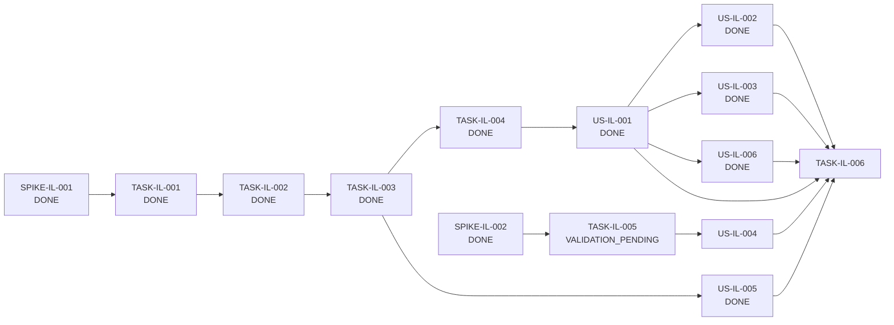

# Block 02 — Enablers, Spikes & Dependencies

**Status:** `IMPLEMENTING / DOMESTIC+FACTUAL SLICES CLOSED / SPIKE-IL-002 DONE / TASK-IL-005 VALIDATION_PENDING`

## Spikes

### PTL-SPIKE-IL-001 — Ledger authority and persistence model

**Status:** DONE

Decision: TAX-04 is a canonical projection over aggregate-owned facts; no duplicate generic ledger store is introduced.

Evidence: [`spike-il-001-ledger-authority.md`](spike-il-001-ledger-authority.md).

---

### PTL-SPIKE-IL-002 — Foreign-service recognition and FX provenance

**Status:** DONE  
**Priority:** P1

Accepted decision:

```text
foreign payer
  -> service source jurisdiction
     -> CHILE
        -> canonical BHE / fee_receipts fact
        -> FX payment is settlement provenance only
     -> FOREIGN
        -> foreign_service_income
        -> perception-based recognition
        -> frozen CLP conversion snapshot with BCCh provenance
```

Closed invariants:

- `foreign payer != foreign-source income`;
- source jurisdiction and payer country are separate dimensions;
- genuine foreign-source honoraria are recognized on perception;
- original amount/currency are preserved;
- CLP conversion is an auditable frozen snapshot, not live revaluation;
- BCCh is the initial official FX authority;
- no silent weekend/holiday previous-business-day assumption;
- unresolved conversion remains `PENDING / NEEDS_REVIEW`;
- manual FX requires explicit source/reference/reason;
- corrections preserve append-only conversion provenance;
- a CLP BHE plus foreign-currency settlement never produces two ledger income facts;
- foreign tax may be captured factually, but article 41 A credit calculation is outside Block 02.

Decision evidence: [`spike-il-002-foreign-service-recognition-fx.md`](spike-il-002-foreign-service-recognition-fx.md).

## Enabling Tasks

### PTL-TASK-IL-001 — TaxLedgerEntry projection contract

**Status:** DONE  
Evidence: [`task-il-001-evidence.md`](task-il-001-evidence.md).

---

### PTL-TASK-IL-002 — Aggregate projection providers

**Status:** DONE  
Evidence: [`task-il-002-evidence.md`](task-il-002-evidence.md).

---

### PTL-TASK-IL-003 — Annual ledger query/read model

**Status:** DONE  
Evidence: [`task-il-003-evidence.md`](task-il-003-evidence.md).

---

### PTL-TASK-IL-004 — Ledger HTTP/client surface

**Type:** Task  
**Role:** ENABLER  
**Priority:** P0  
**Size:** S  
**Status:** DONE

Closed implementation preserves a read-only annual ledger surface and no generic mutation authority.

Evidence: [`task-il-004-evidence.md`](task-il-004-evidence.md).

---

### PTL-TASK-IL-005 — Foreign-service provider/value contract implementation

**Type:** Task  
**Role:** ENABLER  
**Priority:** P1  
**Size:** L  
**Status:** IMPLEMENTED / AUTOMATED_VALIDATION_PENDING

Implemented scope:

- dedicated `foreign_service_income` aggregate for genuinely foreign-source honoraria;
- append-only `foreign_service_fx_conversions` provenance;
- BCCh exact-date conversion provider contract;
- no implicit previous-business-day fallback;
- explicit manual conversion fallback with mandatory provenance;
- annual-context-safe foreign-service use cases;
- `FOREIGN_SERVICE_INCOME` ledger entry kind and owner aggregate;
- `PENDING` until perception date plus a resolved conversion snapshot exist;
- CLP gross projection only for recognized rows;
- Path A protection: CHILE-source services cannot enter `foreign_service_income` and therefore cannot duplicate an existing BHE fact.

Evidence: [`task-il-005-evidence.md`](task-il-005-evidence.md).

Validation is not yet claimed green on the current implementation head.

---

### PTL-TASK-IL-006 — Block-level regression suite

**Type:** Task  
**Role:** QUALITY_ENABLER  
**Priority:** P0  
**Size:** M  
**Status:** NOT_READY_FOR_CLOSURE

Terminal Block 02 regression gate. It must prove projection-only ledger semantics, stable owner identity, annual isolation/stale protection, non-duplicated salary/APV semantics, preserved BHE recognition semantics, traceable totals, and the accepted foreign-service behavior.

## Dependency graph



## Current critical path

```text
PTL-TASK-IL-005 validation + closure
  -> PTL-US-IL-004 foreign payer / foreign-source flow
  -> PTL-TASK-IL-006 terminal regression / DoD
  -> Block 02 CLOSED
```
