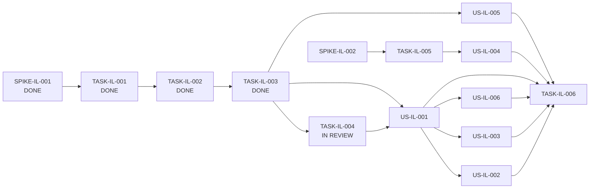

# Block 02 — Enablers, Spikes & Dependencies

**Status:** `IMPLEMENTING / IL-004 IN REVIEW`

## Spikes

### PTL-SPIKE-IL-001 — Ledger authority and persistence model

**Status:** DONE

Decision: TAX-04 is a canonical projection over aggregate-owned facts; no duplicate generic ledger store is introduced.

Evidence: [`spike-il-001-ledger-authority.md`](spike-il-001-ledger-authority.md).

---

### PTL-SPIKE-IL-002 — Foreign-service recognition and FX provenance

**Status:** NOT_STARTED  
**Priority:** P1

Must close before foreign-service income can become canonical:

- recognition date/period;
- original amount/currency;
- CLP value semantics;
- exchange-rate source/date;
- BHE-in-CLP + payment-in-FX relationship;
- correction/revaluation provenance.

No automatic FX provider is authorized by Block 02 until this spike closes.

## Enabling Tasks

### PTL-TASK-IL-001 — TaxLedgerEntry projection contract

**Status:** DONE  
Evidence: [`task-il-001-evidence.md`](task-il-001-evidence.md). Canonical `make validate`: **190/190**, desktop/architecture PASS.

---

### PTL-TASK-IL-002 — Aggregate projection providers

**Status:** DONE  
Evidence: [`task-il-002-evidence.md`](task-il-002-evidence.md). Canonical `make validate`: **195/195**, desktop/architecture PASS.

---

### PTL-TASK-IL-003 — Annual ledger query/read model

**Status:** DONE  
Evidence: [`task-il-003-evidence.md`](task-il-003-evidence.md). Canonical `make validate`: **200/200**, desktop/architecture PASS.

---

### PTL-TASK-IL-004 — Ledger HTTP/client surface

**Type:** Task  
**Role:** ENABLER  
**Priority:** P0  
**Size:** S  
**Status:** IN_REVIEW

Implemented on `feat/block-02-ledger-http-client-surface`:

- explicit `GET /api/tax-ledger` read endpoint;
- exact `entryKind`, `ownerAggregate`, `recognitionState` filters;
- active annual context resolved server-side;
- non-GET methods rejected with 405 before read-model execution;
- local composition assembles providers + read model + router;
- frontend client exposes only `list(filters)` and GET;
- no generic ledger mutation service or storage is introduced.

Evidence: [`task-il-004-evidence.md`](task-il-004-evidence.md). Closure gate: canonical `make validate`.

---

### PTL-TASK-IL-005 — Foreign-service provider/value contract implementation

**Type:** Task  
**Role:** ENABLER  
**Priority:** P1  
**Size:** L  
**Status:** BLOCKED_BY_SPIKE_IL_002

Implements the domain/storage projection decided by the foreign-service/FX spike. Must preserve original-value and conversion provenance.

---

### PTL-TASK-IL-006 — Block-level regression suite

**Type:** Task  
**Role:** QUALITY_ENABLER  
**Priority:** P0  
**Size:** M  
**Status:** NOT_READY_FOR_CLOSURE

Terminal Block 02 regression gate. It must prove projection-only ledger semantics, stable owner identity, annual isolation/stale protection, non-duplicated salary/APV semantics, preserved BHE recognition semantics, traceable totals, and foreign-service behavior only after IL-002/IL-005 are closed.

## Dependency graph



## Critical path

```text
SPIKE-IL-001 [DONE]
 -> TASK-IL-001 [DONE]
 -> TASK-IL-002 [DONE]
 -> TASK-IL-003 [DONE]
 -> TASK-IL-004 [IN REVIEW]
 -> US-IL-001 + US-IL-006
```

`SPIKE-IL-002` remains a parallel P1 discovery path and does not block the domestic ledger slice.
