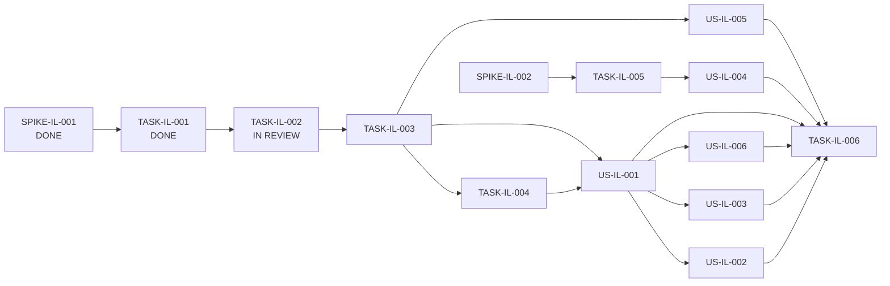

# Block 02 — Enablers, Spikes & Dependencies

**Status:** `IMPLEMENTING / IL-002 IN REVIEW`

## Spikes

### PTL-SPIKE-IL-001 — Ledger authority and persistence model

**Status:** DONE

Decision: TAX-04 is a canonical projection over aggregate-owned facts; no duplicate generic ledger store is introduced.

Evidence: [`spike-il-001-ledger-authority.md`](spike-il-001-ledger-authority.md).

---

### PTL-SPIKE-IL-002 — Foreign-service recognition and FX provenance

**Status:** NOT_STARTED  
**Priority:** P1

Must close before foreign-service income can become canonical:

- recognition date/period;
- original amount/currency;
- CLP value semantics;
- exchange-rate source/date;
- BHE-in-CLP + payment-in-FX relationship;
- correction/revaluation provenance.

No automatic FX provider is authorized by Block 02 until this spike closes.

## Enabling Tasks

### PTL-TASK-IL-001 — TaxLedgerEntry projection contract

**Type:** Task  
**Role:** ENABLER  
**Priority:** P0  
**Size:** M  
**Status:** DONE

Closed contract:

- immutable provider-neutral `TaxLedgerEntry` projection;
- explicit owner aggregate identity;
- factual recognition vocabulary;
- explicit currency + nullable factual amounts;
- provenance summary hook;
- read-only `TaxLedgerProvider.list(context)` port;
- no generic ledger mutation contract or persistence store.

Evidence: [`task-il-001-evidence.md`](task-il-001-evidence.md). Canonical `make validate`: **190/190**, desktop/architecture PASS.

---

### PTL-TASK-IL-002 — Aggregate projection providers

**Type:** Task  
**Role:** ENABLER  
**Priority:** P0  
**Size:** M  
**Status:** IN_REVIEW

Implemented on `feat/block-02-ledger-projection-providers`:

- `income_sources` provider preserving owner authority and input-mode amount semantics;
- `fee_receipts` provider preserving canonical BHE amounts;
- existing `ISSUE_DATE` / `PAID_ONLY` recognition policy reused without redefinition;
- cancelled BHE projected as `EXCLUDED`;
- trusted annual context enforced;
- both providers expose only `list(context)` and never mutate owner aggregates.

Evidence: [`task-il-002-evidence.md`](task-il-002-evidence.md). Closure gate: canonical `make validate`.

---

### PTL-TASK-IL-003 — Annual ledger query/read model

**Type:** Task  
**Role:** ENABLER  
**Priority:** P0  
**Size:** M  
**Status:** BLOCKED_BY_IL_002

Compose provider entries into one deterministic annual ledger with filters, ordering and factual totals.

Must preserve type-specific identity and not infer tax liability/readiness.

---

### PTL-TASK-IL-004 — Ledger HTTP/client surface

**Type:** Task  
**Role:** ENABLER  
**Priority:** P0  
**Size:** S  
**Status:** BLOCKED_BY_IL_003

Expose explicit annual ledger read endpoint/client. Mutating actions remain delegated to existing aggregate-specific endpoints/services.

---

### PTL-TASK-IL-005 — Foreign-service provider/value contract implementation

**Type:** Task  
**Role:** ENABLER  
**Priority:** P1  
**Size:** L  
**Status:** BLOCKED_BY_SPIKE_IL_002

Implements the domain/storage projection decided by the foreign-service/FX spike. Must preserve original-value and conversion provenance.

---

### PTL-TASK-IL-006 — Block-level regression suite

**Type:** Task  
**Role:** QUALITY_ENABLER  
**Priority:** P0  
**Size:** M  
**Status:** NOT_READY_FOR_CLOSURE

Terminal Block 02 regression gate. It must prove:

- ledger is projection-only;
- owner aggregate identity remains stable;
- annual isolation/stale protection;
- salary/APV semantics are not duplicated;
- BHE cancellation/recognition semantics remain intact;
- ledger totals are traceable to entries;
- foreign-service behavior only once IL-002/IL-005 are closed.

## Dependency graph



## Critical path

Current P0 critical path:

```text
SPIKE-IL-001 [DONE]
 -> TASK-IL-001 [DONE]
 -> TASK-IL-002 [IN REVIEW]
 -> TASK-IL-003
 -> TASK-IL-004
 -> US-IL-001 + US-IL-006
```

`SPIKE-IL-002` is a parallel P1 discovery path and must not block the domestic ledger slice.
