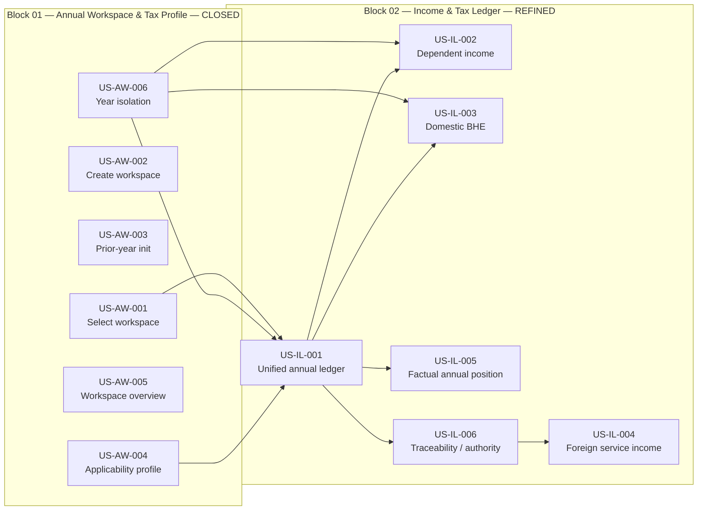

# PTL — Cross-Block Story Dependency Graph

**Status:** `DERIVED / BLOCKS 01-02`  
**Date:** 2026-09-13

This view derives dependencies across refined blocks. Canonical definitions remain in each block directory.

## Current graph



## Material cross-block contracts

### Block 01 -> Block 02

Block 02 consumes, and must not redefine:

- `AnnualTaxWorkspace` identity;
- `commercialYear` as canonical year;
- derived Operación Renta label;
- trusted `AnnualWorkspaceContext`;
- stale/cross-year mutation rejection;
- applicability profile semantics where profile remains distinct from facts.

### Block 02 -> later blocks

Block 02 will become the factual input surface for:

- Block 03 evidence/acquisition attachment and candidate-to-fact workflows;
- Block 06 calculation/explainability;
- Block 07 projection/optimization;
- Block 08 SII reconciliation;
- Block 09 readiness/annual health/closure.

Those edges remain prospective until their destination blocks are refined.

## Current executable dependency path

```text
Block 01 CLOSED
 -> SPIKE-IL-001 DONE
 -> TASK-IL-001 READY
 -> TASK-IL-002
 -> TASK-IL-003
 -> TASK-IL-004
 -> US-IL-001 + US-IL-006
```

No temporal critical-path duration is asserted yet because comparable estimates do not exist across all active nodes.
