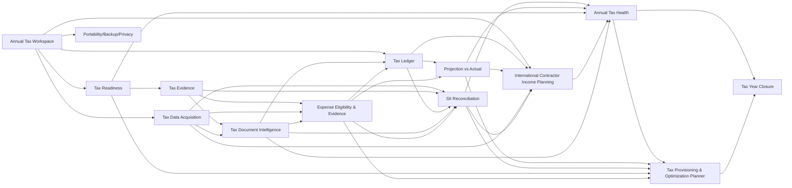

# Backlog — Tax Management Expansion

Estado general: `DISCOVERY / BACKLOG`  
Fuente estratégica: [`../product/tax-management-evolution-and-ms-store-benchmark-2026-09-11.md`](../product/tax-management-evolution-and-ms-store-benchmark-2026-09-11.md)  
Extensión contractor internacional: [`../product/international-contractor-income-planning-2026-09-12.md`](../product/international-contractor-income-planning-2026-09-12.md)  
Caso de uso real anonimizado: [`../product/real-use-case-mixed-income-contractor-tax-planning-2026-09-12.md`](../product/real-use-case-mixed-income-contractor-tax-planning-2026-09-12.md)  
Estrategia local/cloud/AI: [`../product/tax-ecosystem-local-cloud-ai-strategy-2026-09-12.md`](../product/tax-ecosystem-local-cloud-ai-strategy-2026-09-12.md)

## Propósito

Convertir la dirección de producto TAX en slices ejecutables sin interrumpir el backlog P0 ya activo. Este documento no declara capacidades implementadas.

## Epics

### PTL-TAX-01 — Annual Tax Workspace
Consolidar el año tributario como aggregate/lifecycle común para datos, reglas, readiness, reconciliación y cierre.

### PTL-TAX-02 — Tax Readiness
Checklist dinámico de antecedentes, estados de completitud y progreso anual explicable.

### PTL-TAX-03 — Tax Evidence Vault
Evidencia asociada a hechos tributarios con provenance, checksum, revisión y deduplicación.

### PTL-TAX-04 — Tax Ledger / Timeline
Ledger cronológico navegable con origen, período, clasificación, evidencia e impacto tributario.

### PTL-TAX-05 — Projection vs Actual
Comparar acumulado real, proyección de cierre y escenarios alternativos sin contaminar el estado real.

### PTL-TAX-06 — Tax Data Acquisition
Contratos y adapters para entrada manual, importaciones estructuradas y futuras fuentes oficiales/SII permitidas.

### PTL-TAX-07 — SII Reconciliation
Conciliar datos locales con datos reportados/obtenidos desde SII mediante mecanismos oficiales o importaciones asistidas, clasificando diferencias y dejando audit trail.

### PTL-TAX-08 — Annual Tax Health
Vista ejecutiva: resultado actual/proyectado, readiness, conciliación, drivers, riesgos y próximas acciones.

### PTL-TAX-09 — Tax Year Closure
Snapshot reproducible de datos, reglas, conciliación, evidencia y resultado; reapertura controlada.

### PTL-TAX-10 — Portability, Backup & Privacy
Backup/restore, exportación portable, control de datos y políticas de seguridad/retención.

### PTL-TAX-11 — International Contractor Income Planning
Orquestar las capacidades TAX existentes para ingresos contractor internacionales, inicialmente con foco en ingresos en USD para contribuyentes en Chile.

**Objetivo funcional:** responder cuánto dinero recibido puede considerarse realmente disponible y cuánto debe reservarse, además de resolver el cálculo inverso desde un neto objetivo hacia el gross requerido.

**Slices candidatos:**

- `PTL-TAX-11A — Foreign Currency Income`: monto/moneda original, valoración CLP, provenance del tipo de cambio y fees/spread registrados.
- `PTL-TAX-11B — Obligation Provisioning`: separar `received`, `reserved`, `declared`, `paid`, `reconciled` y `available`.
- `PTL-TAX-11C — Gross-to-Net Contractor`: proyectar impuestos, previsión, salud y demás componentes soportados desde un gross contractual.
- `PTL-TAX-11D — Net-to-Gross Target`: calcular cuánto debe cobrarse/facturarse para alcanzar un neto objetivo configurable.
- `PTL-TAX-11E — Contractor Scenario Sensitivity`: comparar monto USD, tipo de cambio, carga efectiva y supuestos sin alterar el ledger real.
- `PTL-TAX-11F — Contractor SII Reconciliation`: vincular ingresos, boletas/antecedentes, declaraciones/pagos y resultado anual mediante la infraestructura de adquisición/conciliación existente.

**Dependencias principales:** `PTL-TAX-01`, `PTL-TAX-04`, `PTL-TAX-05`, `PTL-TAX-06`, `PTL-TAX-07` y reglas puras/versionadas de cálculo. No debe implementarse como calculadora aislada ni acoplarse a Deel u otro proveedor de pagos.

### PTL-TAX-12 — Tax Provisioning & Optimization Planner
Planificar legalmente el cierre tributario antes de Operación Renta, buscando evitar subprovisión, comparar beneficios/deducciones y mostrar el costo económico de cada estrategia.

**Objetivo funcional:** permitir que el usuario responda durante el año “si sigo así, ¿cuánto pagaré o me devolverán y qué acciones legales todavía puedo tomar para mejorar el resultado?”.

**Slices candidatos:**

- `PTL-TAX-12A — Projected Annual Settlement`: estimar impuesto, créditos, PPM, cotizaciones y saldo de cierre con trazabilidad.
- `PTL-TAX-12B — Monthly Reserve Recommendation`: recomendar reserva mensual para llegar al cierre sin sorpresa de caja.
- `PTL-TAX-12C — APV Strategy Comparator`: comparar sin APV, APV régimen A y APV régimen B, mostrando efecto tributario, liquidez comprometida, bonificación/beneficio y consecuencias de retiro.
- `PTL-TAX-12D — Presumed vs Actual Expense Comparator`: comparar 30% de gasto presunto versus gastos efectivos elegibles y respaldados, sin permitir doble rebaja.
- `PTL-TAX-12E — Mixed Income Contribution Reconciliation`: combinar renta dependiente + honorarios, cotizaciones ya enteradas, topes y salud adicional/excesos.
- `PTL-TAX-12F — Legal Tax Opportunity Scanner`: detectar beneficios/deducciones aplicables sólo con evidencia y reglas versionadas; nunca generar gastos ficticios ni ocultar renta.
- `PTL-TAX-12G — Optimization Explainability`: mostrar ahorro tributario por peso comprometido, costo de oportunidad, restricciones y por qué una estrategia domina o no a otra.

**Resultado esperado:** clasificar la posición anual como `UNDERPROVISIONED`, `ON_TARGET`, `OVERPROVISIONED`, `REFUND_EXPECTED`, `PAYMENT_EXPECTED` o `INSUFFICIENT_DATA` y proponer acciones explicables.

**Principio de producto:** una devolución alta no es el objetivo en sí. PTL debe optimizar la carga legal cuando sea económicamente razonable, preservar liquidez y minimizar sorpresas de cierre.

### PTL-TAX-13 — Tax Document Intelligence & Cloud Capability Layer
Separar capacidades locales, providers de AI opcionales y servicios cloud administrados sin duplicar el dominio tributario.

**Objetivo funcional:** permitir que un documento como una liquidación, boleta, certificado, factura o recibo pueda transformarse en candidatos estructurados y semánticamente validados, manteniendo siempre confirmación/auditoría antes de afectar el ledger canónico.

**Slices candidatos:**

- `PTL-TAX-13A — Evidence Ingestion Contract`: documento/evidencia original, metadata, checksum, provenance y lifecycle de procesamiento.
- `PTL-TAX-13B — Extraction Candidate Schema`: contrato neutral para campos extraídos, valores normalizados, confidence, warnings y referencias a evidencia.
- `PTL-TAX-13C — Tax Semantic Validation`: reglas para clasificar AFP, comisión, salud legal, salud adicional, deuda privada, impuesto, renta, gasto, activo, etc.
- `PTL-TAX-13D — Human Confirmation Workflow`: preview, edición, aceptación/rechazo y promoción explícita a canonical ledger.
- `PTL-TAX-13E — Managed Cloud Document Intelligence`: provider administrado, jobs, cuotas, observabilidad y costos de inferencia.
- `PTL-TAX-13F — Local/BYO Provider Adapter`: contrato que permita, en una fase posterior, AI local o API provista por el usuario sin cambiar el dominio.
- `PTL-TAX-13G — Cloud Evidence & Sync`: almacenamiento administrado y sincronización opt-in con identidad, versiones, conflicto y provenance.
- `PTL-TAX-13H — Continuous Tax Monitoring`: eventos/alertas derivados de cambios en ledger, evidencia, proyección y posición de provisionamiento.

**Principio de producto:** Desktop Free sigue siendo útil y completo manualmente. Cloud monetiza automatización, integración e inteligencia continua; AI es un proveedor asistivo y nunca autoridad tributaria.

### PTL-TAX-14 — Expense Eligibility & Evidence Engine
Convertir gastos registrados y su evidencia en candidatos tributarios evaluables, diferenciando importe pagado de monto efectivamente deducible y alimentando continuamente la comparación `presunto vs efectivo`.

**Objetivo funcional:** permitir que el usuario registre todos sus gastos potencialmente profesionales —aunque finalmente no sean deducibles— y que PTL determine su estado, evidencia, tratamiento y efecto proyectado sin contaminar el ledger tributario canónico.

**Slices candidatos:**

- `PTL-TAX-14A — Expense Registry`: fecha, proveedor, descripción, monto, moneda, categoría, recurrencia, origen y notas.
- `PTL-TAX-14B — Expense Evidence`: factura/boleta/recibo/comprobante, checksum, provenance, vínculo al gasto y estado de suficiencia documental.
- `PTL-TAX-14C — Eligibility Assessment`: estados `ELIGIBLE`, `POTENTIALLY_ELIGIBLE`, `NOT_ELIGIBLE`, `NEEDS_REVIEW`, con rationale y regla/fuente versionada.
- `PTL-TAX-14D — Professional Use Allocation`: porcentaje de uso profesional para gastos mixtos como Internet, telefonía u otros casos soportados; nunca asumir 100% silenciosamente.
- `PTL-TAX-14E — Asset & Depreciation Treatment`: distinguir gasto corriente, activo depreciable y tratamientos especiales; separar costo de adquisición de `deductible_amount` anual.
- `PTL-TAX-14F — Recurring Digital Subscriptions`: modelar Microsoft 365, AI, SaaS, cloud, hosting, dominios y otros servicios periódicos, nacionales o extranjeros.
- `PTL-TAX-14G — Foreign Supplier Evidence`: conservar moneda original, proveedor, fecha, documento extranjero, conversión y criterios de respaldo.
- `PTL-TAX-14H — Presumed vs Actual Continuous Comparator`: recalcular continuamente ambos escenarios, benchmark presunto, brecha a superar e impacto tributario incremental.
- `PTL-TAX-14I — Expense Readiness`: detectar evidencia faltante, categorización dudosa, allocation pendiente, tratamiento no resuelto o regla aún no disponible.
- `PTL-TAX-14J — Expense Document Intelligence`: extraer desde recibos/facturas candidatos de proveedor, fecha, monto, moneda, categoría y recurrencia, sujetos al lifecycle de PTL-TAX-13.

**Requerimientos fuertes del caso real:**

- Microsoft 365, ChatGPT, Claude, servicios Google e Internet deben poder registrarse y evaluarse como candidatos profesionales.
- Registrar no significa deducir.
- Internet y otros gastos mixtos requieren asignación profesional explícita y justificable.
- Hardware como computador/tablet debe poder registrarse aunque el beneficio del ejercicio dependa de depreciación/tratamiento.
- El sistema debe mostrar cuánto representa el gasto presunto del año y cuánto suman los gastos efectivos deducibles aceptados/proyectados.
- El usuario debe poder conservar evidencia de gastos efectivos incluso si finalmente declara por gasto presunto.
- La elección anual no debe destruir información ni impedir análisis histórico/futuro.

## Dependencias propuestas

## Reglas de ejecución

- No integrar SII directamente en `packages/core`.
- Matching/reconciliación debe ser auditable y no destructivo.
- Datos externos no sobrescriben silenciosamente información local.
- Preferir mecanismos oficiales/documentados; importación asistida antes que automatización frágil.
- Provisiones no equivalen a declaraciones, pagos ni impuesto anual definitivo.
- Ingresos en moneda extranjera conservan monto/moneda originales; la conversión a CLP es un derivado con provenance.
- No presentar dinero recibido como neto disponible mientras existan obligaciones conocidas o estimadas sin provisionar.
- No acoplar el dominio a Deel ni a un intermediario específico.
- Optimización tributaria significa uso legal y respaldado de alternativas normativas; nunca evasión, ocultamiento de renta o gastos ficticios.
- APV debe evaluarse por efecto tributario + liquidez + beneficio previsional; no recomendarlo sólo porque reduzca impuesto.
- Gastos presuntos y efectivos deben ser alternativas mutuamente excluyentes cuando así lo determine la regla aplicable.
- Un gasto registrado no es automáticamente un gasto deducible.
- `paid_amount`, `professional_allocated_amount` y `deductible_amount` deben ser conceptos distintos.
- Los activos deben preservar costo de adquisición, vida/tratamiento y deducción anual sin colapsarlos en un solo campo.
- La evaluación de elegibilidad debe guardar rule source/effective date/provenance y estado de confianza/revisión.
- AI produce `candidate data`; no produce hechos canónicos sin validación/confirmación.
- Ningún SDK o proveedor AI debe entrar a `packages/core`.
- Local, BYO y Cloud deben converger sobre los mismos contratos de dominio y candidate schema.
- Cloud no reimplementa cálculo tributario; compone el mismo core/application con adapters distintos.
- Sync debe ser explícito y opt-in; no se introduce como side effect de usar la app local.
- Cada epic debe definir DoR/DoD, modelo, contratos, migrations, pruebas y evidencia antes de implementación.
- La secuencia final debe conciliarse con el backlog P0 vigente antes de comenzar.
