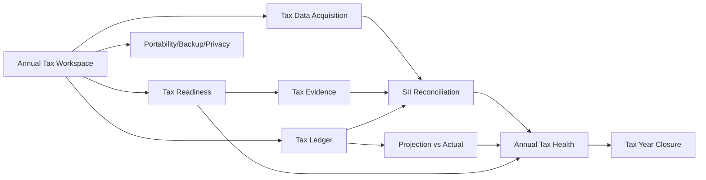

# Backlog — Tax Management Expansion

Estado general: `DISCOVERY / BACKLOG`  
Fuente estratégica: [`../product/tax-management-evolution-and-ms-store-benchmark-2026-09-11.md`](../product/tax-management-evolution-and-ms-store-benchmark-2026-09-11.md)

## Propósito

Convertir la dirección de producto TAX en slices ejecutables sin interrumpir el backlog P0 ya activo. Este documento no declara capacidades implementadas.

## Epics

### PTL-TAX-01 — Annual Tax Workspace
Consolidar el año tributario como aggregate/lifecycle común para datos, reglas, readiness, reconciliación y cierre.

### PTL-TAX-02 — Tax Readiness
Checklist dinámico de antecedentes, estados de completitud y progreso anual explicable.

### PTL-TAX-03 — Tax Evidence Vault
Evidencia asociada a hechos tributarios con provenance, checksum, revisión y deduplicación.

### PTL-TAX-04 — Tax Ledger / Timeline
Ledger cronológico navegable con origen, período, clasificación, evidencia e impacto tributario.

### PTL-TAX-05 — Projection vs Actual
Comparar acumulado real, proyección de cierre y escenarios alternativos sin contaminar el estado real.

### PTL-TAX-06 — Tax Data Acquisition
Contratos y adapters para entrada manual, importaciones estructuradas y futuras fuentes oficiales/SII permitidas.

### PTL-TAX-07 — SII Reconciliation
Conciliar datos locales con datos reportados/obtenidos desde SII mediante mecanismos oficiales o importaciones asistidas, clasificando diferencias y dejando audit trail.

### PTL-TAX-08 — Annual Tax Health
Vista ejecutiva: resultado actual/proyectado, readiness, conciliación, drivers, riesgos y próximas acciones.

### PTL-TAX-09 — Tax Year Closure
Snapshot reproducible de datos, reglas, conciliación, evidencia y resultado; reapertura controlada.

### PTL-TAX-10 — Portability, Backup & Privacy
Backup/restore, exportación portable, control de datos y políticas de seguridad/retención.

## Dependencias propuestas

## Reglas de ejecución

- No integrar SII directamente en `packages/core`.
- Matching/reconciliación debe ser auditable y no destructivo.
- Datos externos no sobrescriben silenciosamente información local.
- Preferir mecanismos oficiales/documentados; importación asistida antes que automatización frágil.
- Cada epic debe definir DoR/DoD, modelo, contratos, migrations, pruebas y evidencia antes de implementación.
- La secuencia final debe conciliarse con el backlog P0 vigente antes de comenzar.