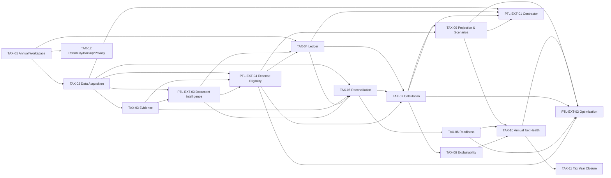

# Backlog — Tax Management Expansion

Estado general: `DISCOVERY / BACKLOG / RECONCILED`  
Fuente estratégica: [`../product/tax-management-evolution-and-ms-store-benchmark-2026-09-11.md`](../product/tax-management-evolution-and-ms-store-benchmark-2026-09-11.md)  
Conciliación de taxonomía: [`../product/tax-capability-reconciliation-2026-09-12.md`](../product/tax-capability-reconciliation-2026-09-12.md)  
Extensión contractor: [`../product/international-contractor-income-planning-2026-09-12.md`](../product/international-contractor-income-planning-2026-09-12.md)  
Caso real anonimizado: [`../product/real-use-case-mixed-income-contractor-tax-planning-2026-09-12.md`](../product/real-use-case-mixed-income-contractor-tax-planning-2026-09-12.md)  
Estrategia local/cloud/AI: [`../product/tax-ecosystem-local-cloud-ai-strategy-2026-09-12.md`](../product/tax-ecosystem-local-cloud-ai-strategy-2026-09-12.md)

## Regla de nomenclatura

`TAX-01..TAX-12` está reservado para las macro-capacidades canónicas definidas el 2026-09-11. Las líneas de producto derivadas del caso real usan `PTL-EXT-xx`; no se numeran como `TAX-13+` salvo promoción transversal explícita.

Los identificadores transitorios `PTL-TAX-11..14` quedan deprecados.

## Macro-capacidades TAX canónicas

### TAX-01 — Annual Tax Workspace
Año tributario como aggregate/lifecycle común para datos, reglas, readiness, conciliación, cálculo, health y cierre.

### TAX-02 — Tax Data Acquisition
Entrada manual, quick entry, importaciones estructuradas, adapters oficiales permitidos, ingestion documental y provenance.

### TAX-03 — Tax Evidence Vault
Evidencia vinculada a hechos tributarios con metadata, checksum, revisión, deduplicación y raw evidence preservado.

### TAX-04 — Tax Ledger
Registro cronológico de hechos con separación entre evento económico, clasificación tributaria y efecto calculado.

### TAX-05 — Tax Reconciliation
Conciliación determinista/auditable entre estado local y fuentes externas oficiales, especialmente SII, sin sobrescritura silenciosa.

### TAX-06 — Tax Readiness
Checklist dinámico derivado de la situación real y del estado de conciliación. Un dato discrepante no cuenta como listo.

### TAX-07 — Tax Calculation
Cálculos puros, versionados por año/regla, con inputs explícitos y sin I/O externo dentro del core.

### TAX-08 — Tax Explainability
Regla/fórmula, inputs/orígenes, pasos, advertencias, supuestos y drill-down a ledger/evidencia.

### TAX-09 — Tax Projection & Scenarios
Actual-to-date, projected close y escenarios alternativos sin mutar el estado real hasta confirmación.

### TAX-10 — Annual Tax Health
Superficie ejecutiva con resultado actual/proyectado, readiness, reconciliación, drivers, riesgos y próximas acciones.

### TAX-11 — Tax Year Closure
Snapshot reproducible del año, reglas usadas, conciliación/readiness final, evidencia, resultado y reapertura controlada.

### TAX-12 — Tax Portability, Backup & Privacy
Export/backup/restore, separación de datos y binarios, eliminación/exportación, retención y seguridad según threat model.

## Extensiones de producto PTL

### PTL-EXT-01 — International Contractor Income Planning

Orquesta TAX-01/02/04/05/07/08/09/10 para ingresos contractor nacionales/internacionales y moneda extranjera.

**Slices:**

- `PTL-EXT-01A — Foreign Currency Income`
- `PTL-EXT-01B — Obligation Provisioning`
- `PTL-EXT-01C — Gross-to-Net Contractor`
- `PTL-EXT-01D — Net-to-Gross Target`
- `PTL-EXT-01E — Contractor Scenario Sensitivity`
- `PTL-EXT-01F — Contractor SII Reconciliation`

**Reglas:** monto/moneda original se preservan; CLP es derivado con provenance; `received != disposable`; no acoplar a Deel ni a un pagador concreto.

### PTL-EXT-02 — Tax Provisioning & Optimization Planner

Permitir responder durante el año: “si sigo así, ¿cuánto pagaré o me devolverán, cuánto debo reservar y qué acciones legales todavía puedo evaluar?”.

**Slices:**

- `PTL-EXT-02A — Projected Annual Settlement`
- `PTL-EXT-02B — Monthly Reserve Recommendation`
- `PTL-EXT-02C — APV Strategy Comparator`
- `PTL-EXT-02D — Presumed vs Actual Expense Comparator`
- `PTL-EXT-02E — Mixed Income Contribution Reconciliation`
- `PTL-EXT-02F — Legal Tax Opportunity Scanner`
- `PTL-EXT-02G — Optimization Explainability`

**Estados objetivo:** `UNDERPROVISIONED`, `ON_TARGET`, `OVERPROVISIONED`, `REFUND_EXPECTED`, `PAYMENT_EXPECTED`, `INSUFFICIENT_DATA`.

**Principio:** optimizar carga legal cuando sea económicamente racional y minimizar sorpresas; una devolución grande no es éxito por sí misma.

### PTL-EXT-03 — Tax Document Intelligence & Cloud Capability Layer

Extiende TAX-02/03/05/06 con extracción asistida, candidate data y servicios cloud sin duplicar el Tax Core.

**Slices:**

- `PTL-EXT-03A — Evidence Ingestion Contract`
- `PTL-EXT-03B — Extraction Candidate Schema`
- `PTL-EXT-03C — Tax Semantic Validation`
- `PTL-EXT-03D — Human Confirmation Workflow`
- `PTL-EXT-03E — Managed Cloud Document Intelligence`
- `PTL-EXT-03F — Local/BYO Provider Adapter`
- `PTL-EXT-03G — Cloud Evidence & Sync`
- `PTL-EXT-03H — Continuous Tax Monitoring`

**Lifecycle obligatorio:**

`RAW_EVIDENCE -> EXTRACTED_CANDIDATE -> SCHEMA_VALIDATED -> TAX_DOMAIN_VALIDATED -> USER_CONFIRMED -> CANONICAL_LEDGER`

Desktop Free sigue útil manualmente; Cloud monetiza automatización e inteligencia continua; AI nunca es autoridad tributaria.

### PTL-EXT-04 — Expense Eligibility & Evidence Engine

Convertir gastos registrados y evidencia en candidatos tributarios evaluables y alimentar continuamente el escenario presunto vs efectivo.

**Slices:**

- `PTL-EXT-04A — Expense Registry`
- `PTL-EXT-04B — Expense Evidence`
- `PTL-EXT-04C — Eligibility Assessment`
- `PTL-EXT-04D — Professional Use Allocation`
- `PTL-EXT-04E — Asset & Depreciation Treatment`
- `PTL-EXT-04F — Recurring Digital Subscriptions`
- `PTL-EXT-04G — Foreign Supplier Evidence`
- `PTL-EXT-04H — Presumed vs Actual Continuous Comparator`
- `PTL-EXT-04I — Expense Readiness`
- `PTL-EXT-04J — Expense Document Intelligence`

**Requerimientos fuertes derivados del caso real:**

- Microsoft 365, ChatGPT, Claude, servicios Google e Internet pueden registrarse como candidatos profesionales.
- Registrar no significa deducir.
- Gastos mixtos requieren allocation profesional explícito y justificable.
- Hardware/computador/tablet deben soportar tratamiento como activo/depreciación cuando corresponda.
- Deben coexistir y compararse `presumed expense` y `actual deductible expense` sin destruir evidencia.
- `paid_amount`, `professional_allocated_amount` y `deductible_amount` son conceptos distintos.
- La evaluación guarda `rule source`, `effective date`, provenance y estado de revisión.

## Caso real de aceptación conceptual

El fixture conceptual actual debe soportar simultáneamente:

- renta dependiente;
- BHE nacional de septiembre por CLP 2.500.000 bruto;
- eventual contractor internacional desde octubre por USD 5.500/mes;
- retenciones/PPM;
- AFP, salud legal, adicional Isapre y potencial exceso/excedente;
- descuentos privados de planilla separados de tributación;
- APV y provisión mensual;
- gastos presuntos versus efectivos;
- suscripciones profesionales recurrentes e Internet;
- evidencia documental y futura extracción asistida.

## Dependencias

## Reglas de ejecución

- No integrar SII directamente en `packages/core`.
- Fuentes externas no sobrescriben silenciosamente el ledger.
- Preferir servicio oficial documentado -> export oficial -> importación asistida -> entrada manual controlada.
- Matching/reconciliación es auditable y no destructivo.
- Provisiones no equivalen a declaraciones, pagos ni impuesto anual definitivo.
- Ingresos en moneda extranjera conservan monto/moneda original y provenance de conversión.
- Gastos presuntos y efectivos se comparan como alternativas cuando la norma lo determine; no se mezclan indebidamente.
- Un gasto registrado no es automáticamente deducible.
- AI produce candidate data, nunca hechos canónicos sin confirmación.
- Ningún SDK/proveedor AI entra al Tax Core.
- Local/BYO/Cloud convergen sobre contratos comunes.
- Cloud compone el mismo dominio; no reimplementa cálculo tributario.
- Sync es explícito y opt-in.
- Cada slice requiere DoR/DoD, reglas/fuentes, contratos, migraciones si aplican, tests y evidencia.
- La secuencia final se concilia con P0 antes de implementación.
