# Pre-estándar ADÜMÜN — Publicación de aplicaciones Windows en Microsoft Store

**Estado:** `PRE_STANDARD / PROVING_GROUND`  
**Origen empírico:** Personal Tax Ledger 0.1.5.0  
**Ámbito:** aplicaciones Windows desktop empaquetadas como MSIX y publicadas mediante Microsoft Partner Center / Microsoft Store  
**Autoridad actual:** este documento es una pre-estandarización derivada de una ejecución real; todavía no debe interpretarse como estándar corporativo cerrado.

## 1. Propósito

Definir un proceso repetible, verificable y basado en evidencia para llevar una aplicación Windows desde un artefacto desktop funcional hasta una submission real de Microsoft Store, incluyendo identidad Store, MSIX, firma/sideload de desarrollo, Windows App Certification Kit (WACK), metadata pública, declaraciones regulatorias, capabilities restringidas, certificación y gates posteriores a publicación.

El objetivo no es documentar sólo “qué botones apretar”, sino establecer un lifecycle gobernado con DoR/DoD, artefactos, responsabilidades, evidencia y condiciones de transición.

## 2. Principios

1. **Store identity is canonical.** El `Package/Identity/Name`, `Publisher`, `PublisherDisplayName`, PFN y Store ID deben venir de Partner Center y ser reproducidos exactamente en el manifest.
2. **El artefacto Store y el artefacto de sideload son lanes distintos.** El sideload puede usar una firma de desarrollo; el paquete de submission no debe confundirse con ese artefacto.
3. **No usar una firma self-signed como prueba de confianza pública.** Smart App Control puede bloquear un sideload firmado con un certificado de desarrollo; la confianza pública se valida con el artefacto procesado por Store.
4. **WACK es gate previo obligatorio del proceso interno.** Un resultado global `PASS` es evidencia previa a submission.
5. **Capabilities restringidas requieren justificación explícita.** `runFullTrust` no se debe declarar sin necesidad real ni sin una explicación de uso acotado.
6. **Metadata Store debe ser factual.** No declarar accesibilidad, hardware, backup, compras, AI, Mixed Reality u otras capacidades no verificadas.
7. **No publicar globalmente por defecto.** El mercado debe reflejar alcance funcional y regulatorio real.
8. **Las evidencias son parte del entregable.** Logs, hashes, reportes WACK, manifest, screenshots y checkpoints de Partner Center se conservan junto al proceso.
9. **Publicación no equivale a cierre.** Tras certificación deben existir gates de instalación Store, firma Store, Smart App Control, runtime, persistencia, upgrade y soporte.
10. **DoR/DoD por etapa.** Ninguna transición importante ocurre sólo por “parece funcionar”.

## 3. Lifecycle propuesto

```mermaid
flowchart LR
  A[Store Identity Reserved] --> B[Store MSIX Staging]
  B --> C[Native Packaging]
  C --> D[Controlled Sideload]
  D --> E[WACK]
  E --> F[Partner Center Metadata]
  F --> G[Package Upload]
  G --> H[Restricted Capability Justification]
  H --> I[Submit for Certification]
  I --> J[Pre-processing]
  J --> K[Certification]
  K --> L[Publishing]
  L --> M[Store-signed Runtime Validation]
  M --> N[Release Closed]
```

## 4. Etapas y gates

### S0 — Store identity

**DoR**
- producto con nombre estable;
- cuenta Partner Center habilitada;
- decisión de publisher establecida.

**Artefactos**
- `Package/Identity/Name`;
- `Package/Identity/Publisher`;
- `PublisherDisplayName`;
- PFN;
- Store ID;
- Store deep link / URL cuando corresponda.

**DoD**
- identidad persistida en configuración versionada;
- staging MSIX reproduce los valores exactamente;
- no existen valores placeholder.

### S1 — MSIX Store staging

**DoR**
- build desktop reproducible;
- manifest base y assets disponibles;
- arquitectura y `TargetDeviceFamily` definidos.

**Controles**
- versión SemVer normalizada a cuatro componentes para MSIX;
- arquitectura explícita;
- `Windows.Desktop` y `MinVersion` coherentes;
- assets declarados presentes;
- capabilities mínimas necesarias.

**DoD**
- staging determinista;
- manifest parseable;
- identidad Store exacta;
- package metadata machine-readable generado.

### S2 — Controlled sideload lane

Esta etapa valida packaging, instalación, upgrade y datos. No prueba confianza pública.

**DoR**
- certificado de desarrollo controlado;
- cadena de confianza instalada sólo en entorno UAT autorizado.

**DoD**
- instalación MSIX exitosa;
- launch posible cuando la política local lo permite;
- upgrade in-place verificado;
- persistencia histórica comprobada;
- no duplicación inesperada de DB/workspace.

**Regla:** un bloqueo de Smart App Control sobre un certificado self-signed no implica por sí solo un defecto del paquete Store.

### S3 — Store submission package

**DoR**
- staging Store listo;
- signing de desarrollo no contaminando el artefacto.

**Controles**
- empaquetar con Windows SDK `MakeAppx.exe`;
- round-trip unpack y validación de identidad;
- SHA-256 del `.msix`;
- esperado `Authenticode: NotSigned` antes del procesamiento Store cuando se usa este lane.

**DoD**
- artefacto Store reproducible;
- round-trip PASS;
- hash persistido;
- nombre/version/arquitectura exactos.

### S4 — Windows App Certification Kit

**DoR**
- WACK instalado;
- package Store final disponible;
- shell elevada cuando WACK lo requiera.

**DoD**
- `OVERALL_RESULT="PASS"`;
- `PARTIAL_RUN="FALSE"`;
- reporte XML persistido;
- log de ejecución persistido;
- warnings/fallos opcionales analizados, no ignorados.

**Lección PTL:** WACK puede reportar un test opcional `Blocked executables` como FAIL por heurísticas dentro de Electron/Chromium y, aun así, entregar resultado global PASS. La decisión debe basarse en el resultado global y en el análisis del detalle, no en ocultar el warning.

### S5 — Pricing and availability

**Decisiones mínimas**
- mercados;
- audiencia;
- discoverability;
- release schedule;
- stop acquisition;
- precio base;
- trial/sale pricing si aplica.

**Default recomendado para software gratuito de alcance nacional**
- restringir al mercado funcional real;
- `Public audience`;
- discoverable;
- `As soon as possible`;
- `Stop acquisition: never`;
- base price `Free`;
- no trial para producto gratuito;
- no habilitar futuros mercados automáticamente cuando el dominio es regulatorio/local.

### S6 — Properties

Debe declararse sólo lo probado.

**Checklist**
- categoría/subcategoría;
- tratamiento de información personal;
- URL de privacy policy;
- soporte;
- Mixed Reality desactivado salvo producto realmente inmersivo;
- declaraciones de compras, accessibility, alternate drives, OneDrive backup, recording, pen/ink, generative AI sólo si existen y fueron verificadas;
- requisitos de hardware mínimos sólo cuando están respaldados.

### S7 — Age ratings / IARC

**DoD**
- app type correcto;
- respuestas coherentes con el producto;
- ratings revisados antes de aceptar;
- ID/certificado IARC persistido cuando Partner Center lo genere.

Para una utilidad financiera sin contenido relevante para edad, interacciones sociales, bienes digitales ni productos restringidos, es esperable obtener ratings equivalentes a `All ages / Everyone / 3+`, pero nunca debe preseleccionarse una respuesta sólo para conseguir ese resultado.

### S8 — Packages

**DoR**
- package Store generado;
- WACK PASS.

**DoD**
- upload aceptado;
- versión/arquitectura/device family reconocidos correctamente;
- package `Validated`;
- futuras device families no habilitadas automáticamente salvo decisión consciente;
- warnings de capabilities restringidas capturados.

### S9 — Store listing

**DoD mínimo**
- idioma de listing alineado al mercado;
- nombre;
- descripción factual;
- features;
- short description;
- keywords;
- copyright/developed by;
- al menos un screenshot; recomendado cuatro;
- screenshots sin datos personales reales;
- logos/promotional art sólo cuando se decide explícitamente;
- privacy/support URLs válidas.

**Regla de evidencia:** las capturas comerciales deben usar datos ficticios o anonimizados.

### S10 — Submission options y restricted capabilities

Para `runFullTrust`, la justificación debe explicar:
- por qué el modelo desktop lo necesita;
- qué operaciones concretas dependen de él;
- que ejecuta con permisos estándar del usuario;
- que no instala drivers/servicios ni exige elevación normal si eso es cierto;
- que no se usa para evadir controles de Windows.

**Patrón de justificación validado conceptualmente**

> The application is an Electron-based Win32 desktop app packaged as MSIX. It requires runFullTrust to run the desktop runtime, access local user-data/workspace files, use local SQLite storage, and communicate with its local application service under the signed-in user's standard permissions. It does not install drivers or services, does not require administrator elevation during normal use, and does not use runFullTrust to bypass Windows security controls.

Este texto debe adaptarse a cada producto; no copiarlo si la arquitectura real difiere.

### S11 — Submission for certification

**DoR**
- todas las secciones Partner Center en `Complete`;
- package `Validated`;
- WACK PASS;
- restricted capability justification completada;
- evidence set congelado.

**DoD**
- Partner Center muestra `In certification`;
- `Submission` completado;
- `Pre-processing` iniciado;
- publishing policy confirmada;
- checkpoint persistido.

### S12 — Post-certification / Store-signed validation

Todavía no se considera cerrado al recibir `Certification PASS`.

**Gates**
- Store publica o entrega package procesado;
- instalación desde Store;
- firma/publisher final;
- Smart App Control no bloquea;
- launch;
- listener/runtime local correcto;
- no firewall prompt inesperado;
- userData/workspace/DB preservados;
- actualización desde versión anterior;
- no duplicación de datos;
- deep link / Store URL funcional.

## 5. Evidencia obligatoria

Cada ejecución debe conservar, como mínimo:

- identidad Store;
- manifest Store;
- metadata de build;
- package filename/version/architecture/size/SHA-256;
- resultado Authenticode previo a Store;
- WACK log + XML;
- screenshots de Partner Center en milestones;
- valores finales de pricing/properties/ratings/packages/listing/submission options;
- justificación de capabilities restringidas;
- estado al enviar a certification;
- respuesta/reporte de certification;
- evidencia post-publicación.

Toda evidencia binaria debe tener hash SHA-256 y una descripción semántica.

## 6. DoR/DoD global

### DoR para enviar a Store
- identidad Partner Center congelada;
- artefacto Store reproducible;
- WACK PASS;
- package hash persistido;
- metadata factual;
- privacy policy accesible;
- screenshots preparados con datos ficticios;
- capabilities restringidas justificadas;
- mercado y precio definidos.

### DoD de publicación
- certification PASS;
- publishing completo;
- Store URL activa;
- Store-signed installation PASS;
- Smart App Control PASS;
- runtime/persistencia/upgrade PASS;
- documentación/evidencia cerradas;
- backlog generado para architecture variants, update channel, soporte y observabilidad.

## 7. Excepciones y no-go

No enviar a certificación si:
- identidad del manifest no coincide con Partner Center;
- WACK global no está en PASS sin una excepción formal;
- package está firmado accidentalmente con identidad distinta;
- listing promete capacidades no implementadas;
- screenshots contienen datos personales reales;
- `runFullTrust` u otra restricted capability carece de necesidad y justificación;
- el producto se publica en mercados donde su función regulatoria no aplica;
- no existe política de privacidad cuando el producto accede a información personal.

## 8. Evolución hacia estándar corporativo

Para promover este pre-estándar a estándar ADÜMÜN se requieren al menos:
1. segunda aplicación real que ejecute el proceso;
2. extracción de variables producto-específicas;
3. definición formal de owners/RACI;
4. automatización del evidence manifest;
5. soporte multi-arquitectura x64/arm64;
6. política de versionamiento/release;
7. plantillas de listing y privacy;
8. integración con Execution Fabric / gates / provenance;
9. taxonomía de fallos de Partner Center y certification;
10. procedimiento de rollback/stop acquisition/update.

Hasta entonces, este documento es una **baseline operacional probada**, no una norma inmutable.
