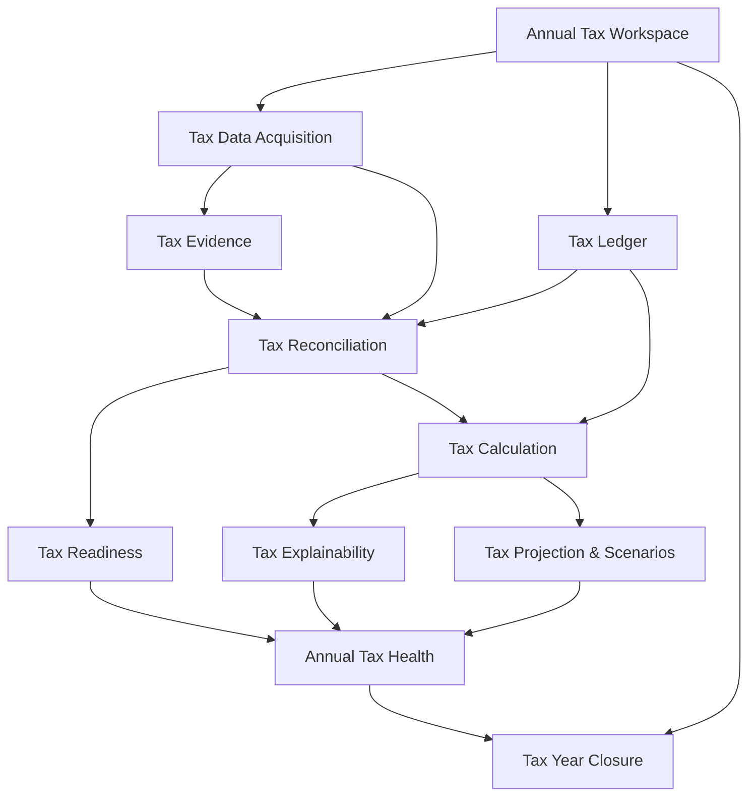

# PTL — evolución hacia Personal Tax Management

**Fecha:** 2026-09-11  
**Estado:** `PRODUCT_DIRECTION / DISCOVERY`  
**Autoridad:** GitHub técnico/producto; Drive conserva framing y lifecycle complementario.

## Objetivo

Persistir el benchmark de aplicaciones que aparecen alrededor de Personal Tax Ledger en Microsoft Store y convertir las observaciones útiles en una dirección de producto coherente. La intención no es transformar PTL en una aplicación genérica de finanzas personales, sino profundizar su especialización como sistema de gestión tributaria personal para Chile.

Dirección propuesta:

```text
Personal Tax Estimator + Ledger
        -> Personal Tax Management System
        -> Tax data + evidence + readiness + reconciliation + simulation + explainability + year lifecycle
```

Ninguna capacidad descrita como propuesta se considera implementada hasta existir código, tests y evidencia correspondiente.

## Benchmark y observaciones incorporables

Aplicaciones revisadas:

1. Money - Personal Financial and Accounting Ledger.
2. Tax Document Organizer.
3. Personal Budget Tracking.
4. Alzex Finance Pro.
5. PocketLedger.
6. Simple Annual Accounting.

Los porcentajes discutidos durante el benchmark son referencias cualitativas de solapamiento funcional, no métricas verificadas de producto.

### 1. Tax Document Organizer

**Observación principal:** organización de antecedentes tributarios por año, documentos esperados/recibidos y preparación del cierre.

**Incorporar a PTL:**

1. `Tax Readiness`: checklist dinámico por año tributario.
2. Estados por antecedente: `EXPECTED`, `RECEIVED`, `MISSING`, `NOT_APPLICABLE`, `NEEDS_REVIEW`.
3. Determinar antecedentes esperados según la configuración real del contribuyente: remuneraciones, honorarios, APV, hipotecario, retenciones, PPM y otras fuentes soportadas.
4. Progreso de preparación anual, evitando que sea un porcentaje decorativo: debe derivarse de requisitos concretos.
5. Asociar evidencia documental a hechos tributarios específicos.
6. Capacidad futura de extracción asistida de datos desde documentos, manteniendo confirmación humana antes de alterar el ledger canónico.
7. Alertas por evidencia faltante, duplicada, inconsistente o no conciliada.

### 2. Money - Personal Financial and Accounting Ledger

**Observación principal:** el ledger longitudinal permite entender de dónde viene el estado financiero actual.

**Incorporar a PTL:**

8. Convertir `Ledger` en una capacidad de producto explícita y visible.
9. `Tax Timeline`: línea de tiempo cronológica de eventos con impacto tributario.
10. Cada evento debe conservar origen, fecha, período, monto, naturaleza, clasificación tributaria y evidencia asociada.
11. Permitir navegar desde un resultado anual hacia los eventos que lo explican.
12. Diferenciar evento económico, tratamiento tributario y efecto calculado; no reducir el modelo a una simple tabla de ingresos/gastos.
13. Vista longitudinal por mes/año para observar cómo se construye la posición tributaria.

### 3. Personal Budget Tracking

**Observación principal:** el contraste entre esperado y real es inmediatamente comprensible para usuarios no expertos.

**Incorporar a PTL:**

14. `Projection vs Actual` tributario.
15. Comparar proyección anual, acumulado real y proyección de cierre.
16. Mostrar desviaciones en renta imponible, retenciones, PPM, APV, rebajas, impuesto estimado y saldo esperado.
17. Explicar las causas materiales de una desviación: nuevo empleador, aumento de honorarios, APV menor al supuesto, etc.
18. Permitir escenarios alternativos sin contaminar el estado real del contribuyente.
19. Mantener claramente separados `actual`, `projected` y `scenario`.

### 4. Alzex Finance Pro

**Observación principal:** grandes volúmenes de información siguen siendo útiles cuando tienen dimensiones, filtros y reportes consistentes.

**Incorporar a PTL:**

20. Etiquetas/contextos tributarios controlados, no tags arbitrarios sin semántica.
21. Clasificación por fuente: empleador, honorario, inversión u otra fuente soportada.
22. Clasificación por naturaleza: recurrente/extraordinario.
23. Clasificación por tratamiento: tributable, exento, rebaja, crédito, retención u otra categoría normativa.
24. Contextos de trabajo/fuente para múltiples empleadores o actividades.
25. Reportes navegables desde distintas dimensiones: fuente, período, categoría, evidencia y efecto tributario.
26. Campos extensibles sólo cuando exista una necesidad funcional real; no convertir el modelo tributario en un esquema EAV genérico.
27. Audit trail para cambios significativos en datos que afecten un cálculo.

### 5. PocketLedger

**Observación principal:** captura simple, funcionamiento local y privacidad pueden ser propuesta de valor y no sólo decisiones técnicas.

**Incorporar a PTL:**

28. Mantener `local-first` como atributo de producto explícito.
29. Comunicar claramente que las capacidades locales no requieren una cuenta online.
30. `Quick Tax Entry`: captura rápida para hechos comunes sin atravesar formularios extensos.
31. Plantillas para eventos repetitivos, especialmente remuneraciones, retenciones y honorarios.
32. Import/export legible y portable para que el usuario mantenga control de sus datos.
33. Dashboard y visualizaciones sencillas que no sacrifiquen explainability.
34. Diseñar privacidad, respaldo y portabilidad como capacidades visibles, no como notas técnicas.

### 6. Simple Annual Accounting

**Observación principal:** el año debe poder comprenderse como una unidad cerrable y resumible.

**Incorporar a PTL:**

35. `Annual Tax Workspace`: el año tributario como aggregate/espacio de trabajo explícito.
36. Resumen anual de lectura inmediata: ingresos considerados, base tributable, impuesto estimado, retenciones/PPM, principales beneficios/rebajas y saldo final.
37. Estados del año: preparación, en progreso, listo para revisar, conciliado, cerrado/reabierto según reglas futuras.
38. Cierre anual con snapshot reproducible de datos, reglas y cálculo.
39. Comparación entre años sin mezclar reglas tributarias de períodos diferentes.
40. Historial de cierres/reaperturas y motivo.

## Obtención y conciliación de datos desde SII

Esta capacidad se incorpora como línea estratégica propia. No se presupone que exista una API pública específica para cada dato requerido; cada integración debe usar mecanismos oficiales y permitidos. Si un dato sólo puede obtenerse mediante descarga manual desde SII, PTL debe soportar importación asistida antes que automatizaciones frágiles o no autorizadas.

### Principios

41. El dato proveniente del SII es una **fuente externa autoritativa de referencia**, pero no debe sobrescribir silenciosamente el ledger local.
42. Toda incorporación debe registrar provenance: fuente, mecanismo, fecha de obtención, período y hash/identificador del artefacto cuando aplique.
43. Credenciales del SII no deben almacenarse en texto plano ni reutilizarse mediante automatización no autorizada.
44. Prioridad de integración: APIs/servicios oficiales documentados -> archivos/exportaciones oficiales -> importación asistida -> entrada manual controlada.
45. La ausencia de integración automática no debe impedir el flujo tributario local.

### Tax Data Acquisition

46. Crear una capa `Tax Data Acquisition` desacoplada del motor de cálculo.
47. Definir adapters por fuente/formato; el dominio no debe depender de HTML, CSV o endpoints concretos del SII.
48. Soportar inicialmente importaciones reproducibles de archivos que el usuario obtenga oficialmente desde SII cuando esos formatos sean identificados y validados.
49. Mantener `raw evidence` inmutable junto con una proyección normalizada para conciliación.
50. Permitir preview antes de importar: nuevos registros, cambios, duplicados y datos no reconocidos.
51. Importaciones idempotentes: reimportar el mismo artefacto no debe duplicar hechos.
52. Registrar errores por fila/registro sin invalidar necesariamente un lote completo cuando sea seguro continuar.

### Tax Reconciliation

53. Crear `Tax Reconciliation` como bounded capability separada de `Tax Calculation`.
54. Conciliar `LOCAL_DECLARED` contra `EXTERNAL_REPORTED` y producir diferencias explícitas.
55. Estados mínimos sugeridos: `MATCHED`, `LOCAL_ONLY`, `SII_ONLY`, `AMOUNT_MISMATCH`, `PERIOD_MISMATCH`, `IDENTITY_MISMATCH`, `DUPLICATE_CANDIDATE`, `NEEDS_REVIEW`.
56. Matching determinista primero; heurísticas sólo como sugerencias revisables.
57. Nunca modificar automáticamente datos locales ante una discrepancia sin política y confirmación explícitas.
58. Permitir resolución: aceptar dato externo, conservar local, fusionar, marcar excepción o postergar.
59. Toda resolución debe dejar audit trail.
60. Reconciliación por dominio: remuneraciones, honorarios, retenciones/PPM, APV, hipotecario y futuras categorías soportadas.
61. Resumen de conciliación anual con conteos y montos conciliados/no conciliados.
62. `Tax Readiness` debe consumir el resultado de conciliación: un antecedente presente pero inconsistente no equivale a antecedente listo.

## Estructura funcional TAX propuesta

La palabra `TAX` se utiliza como macroestructura de capacidades, no como un nuevo monolito técnico.



### TAX-01 — Annual Tax Workspace

63. Identidad del contribuyente/workspace local y año tributario.
64. Reglas y parámetros tributarios versionados por año.
65. Estado del lifecycle del año.
66. Fuente común para readiness, ledger, conciliación, proyección y cierre.

### TAX-02 — Tax Data Acquisition

67. Ingreso manual.
68. Quick entry.
69. Importación estructurada.
70. Adapters SII/oficiales cuando exista un mecanismo permitido.
71. Importación de evidencia documental.
72. Provenance y raw source preservation.

### TAX-03 — Tax Evidence Vault

73. Evidencia asociada a un hecho tributario, no sólo archivos sueltos.
74. Metadata: tipo, período, emisor/origen, fecha, checksum y vínculo con registros.
75. Estado de revisión y validez funcional.
76. Detección de duplicados.
77. Extracción futura asistida/OCR con confirmación humana.

### TAX-04 — Tax Ledger

78. Registro cronológico de hechos tributariamente relevantes.
79. Separación entre dato económico, clasificación tributaria y efecto calculado.
80. Navegación bidireccional entre hechos, evidencia y resultados.
81. Filtros por año, período, fuente, categoría y contexto.
82. Audit trail de cambios.

### TAX-05 — Tax Reconciliation

83. Comparación local vs SII/otras fuentes oficiales.
84. Matching y clasificación de discrepancias.
85. Cola de revisión.
86. Resolución explícita y auditable.
87. Estado agregado de conciliación del año.

### TAX-06 — Tax Readiness

88. Checklist generado desde la situación tributaria real.
89. Antecedentes esperados/recibidos/faltantes/no aplicables/en revisión.
90. Dependencias entre antecedentes.
91. Progreso anual derivado y explicable.
92. Alertas por inconsistencias y pendientes.
93. Readiness no alcanza 100% mientras existan discrepancias materiales sin resolver.

### TAX-07 — Tax Calculation

94. Mantener cálculos puros y versionados por año/regla.
95. Inputs explícitos y reproducibles.
96. No incorporar I/O de SII, documentos ni UI dentro del core de cálculo.
97. Diferenciar cálculo oficial/estimado cuando el alcance del producto así lo requiera.

### TAX-08 — Tax Explainability

98. Explicar fórmula/regla aplicada.
99. Mostrar inputs y sus orígenes.
100. Mostrar pasos intermedios relevantes.
101. Advertencias, supuestos y limitaciones.
102. Drill-down desde el resultado hacia ledger/evidencia.

### TAX-09 — Tax Projection & Scenarios

103. `Actual to date`.
104. `Projected close`.
105. Escenario base y escenarios alternativos.
106. Diferencia absoluta y relativa entre escenarios.
107. Explicación de drivers de cambio.
108. Escenarios no alteran el ledger real hasta confirmación explícita de un hecho.

### TAX-10 — Annual Tax Health

109. Superficie ejecutiva del año.
110. Resultado estimado actual/proyectado.
111. Nivel de readiness.
112. Estado de conciliación.
113. Mayores drivers y riesgos.
114. Cambios desde la última revisión.
115. Acciones siguientes priorizadas.

### TAX-11 — Tax Year Closure

116. Snapshot reproducible del año.
117. Versiones de reglas y parámetros usadas.
118. Estado final de conciliación/readiness.
119. Evidencia asociada.
120. Resultado y explicación final.
121. Reapertura controlada con motivo y nuevo revision lineage.

### TAX-12 — Tax Portability, Backup & Privacy

122. Exportación portable del workspace.
123. Backup/restore verificado.
124. Separación entre datos personales y binarios de la aplicación.
125. Controles claros para eliminar/exportar datos.
126. Política de retención local de artefactos importados.
127. Cifrado/seguridad a evaluar según threat model; no asumirlo implementado actualmente.

## Límites de producto

Para proteger la diferenciación de PTL:

- no convertirlo en gestor bancario general;
- no perseguir budgeting doméstico genérico;
- no replicar P&L empresarial salvo que exista un caso tributario personal concreto;
- no incorporar inversiones/portafolios como fin en sí mismo;
- no automatizar portales externos mediante técnicas frágiles cuando no exista un mecanismo autorizado;
- toda capacidad financiera nueva debe justificar su aporte al lifecycle tributario personal.

## Secuencia sugerida de producto

Orden conceptual, sujeto a conciliación con el backlog activo:

1. `TAX-01 Annual Tax Workspace` — consolidar el aggregate anual existente.
2. `TAX-06 Tax Readiness` — alto valor visible con bajo acoplamiento externo.
3. `TAX-03 Tax Evidence Vault` — evidencia vinculada a hechos.
4. `TAX-04 Tax Ledger` — hacer explícita la trazabilidad longitudinal.
5. `TAX-09 Projection & Scenarios` — fortalecer comparación actual/proyectado.
6. `TAX-02 Tax Data Acquisition` — contratos/adapters antes de integrar SII.
7. `TAX-05 Tax Reconciliation` — conciliación determinista y auditable.
8. `TAX-10 Annual Tax Health` — superficie ejecutiva que integra las anteriores.
9. `TAX-11 Tax Year Closure` — snapshot/cierre formal.
10. `TAX-12 Portability, Backup & Privacy` evoluciona transversalmente y no debe posponerse hasta el final.

## Resultado estratégico

La posición objetivo de PTL no es “otra app de finanzas personales”. Es una aplicación local-first especializada en gestión tributaria personal chilena que integra:

```text
TAX DATA
+ TAX EVIDENCE
+ TAX LEDGER
+ SII RECONCILIATION
+ TAX READINESS
+ TAX CALCULATION
+ TAX EXPLAINABILITY
+ TAX PROJECTION
+ ANNUAL TAX HEALTH
+ TAX YEAR LIFECYCLE
```

Esta estructura transforma la fortaleza actual —cálculo tributario explicable— en un sistema que acompaña al usuario durante todo el año y mantiene trazabilidad desde la evidencia original hasta el resultado final.